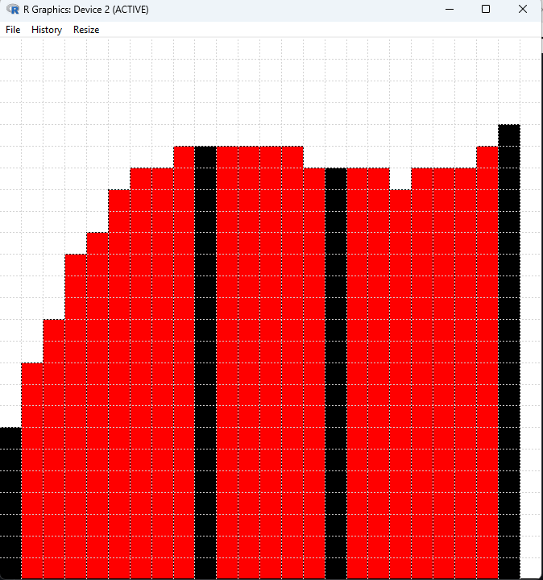

# r_minecraft_fill
Small R script that displays how to fill gaps straightly or smoothly. For designing Minecraft builds.

# Dependencies
None. This script uses base R capabilities only, including the `grid` library.

# Usage

Use `source()` to load "minecraft.R" from an appropriate working directory.

The functions in this script are intended for the following use:
1. Start with a popup window containing a grid, representing an area in Minecraft.
2. Click on the grid to draw out the contour of the currently-existing blocks in your world in black. You should be drawing a curve with horizontal gaps.
3. Right-click and select "Quit".
4. Red bars will appear, showing how to fill the gap.

Caveats:
- This works best when you draw 3 or more isolated black bars.
- Smooth gap-filling may give wilder results if you have multiple black bars very close together or touching.

# Function

Enter `fillsmooth()` into the terminal to fill gaps smoothly. This uses Lagrange polynomial interpolation.

Enter `fillstraight()` into the terminal to fill gaps with straight (diagonal) lines.

# Canvas Size

The default canvas size is `25 x 25`. To change this, provide `x` and `y` arguments to your function.

Example: `fillsmooth(x=30, y=15)`